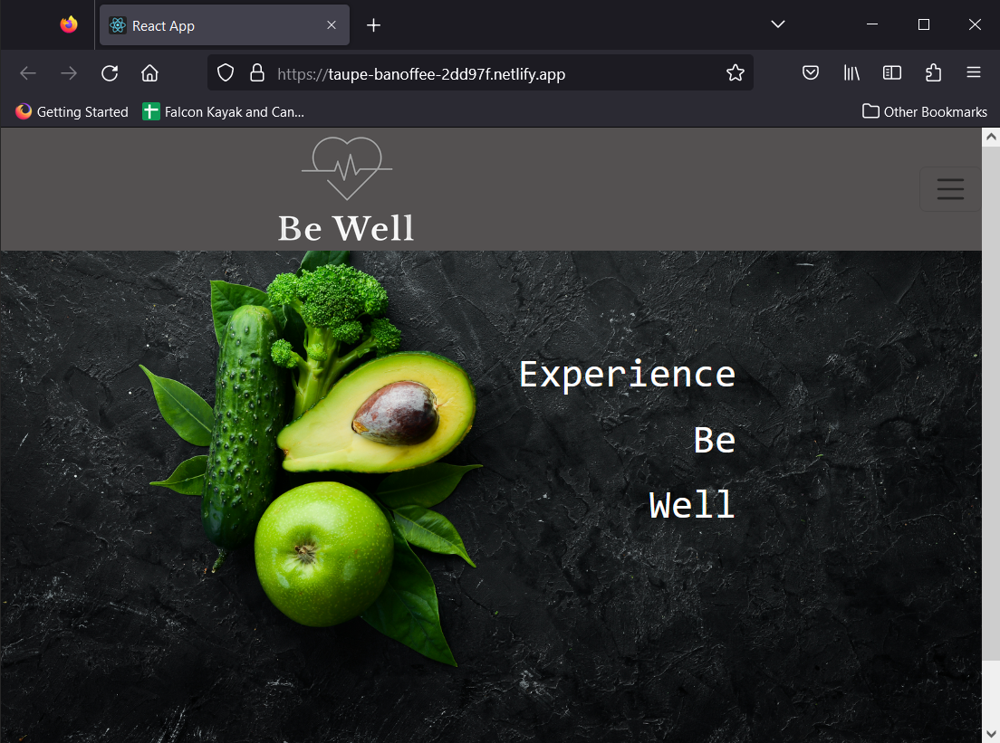
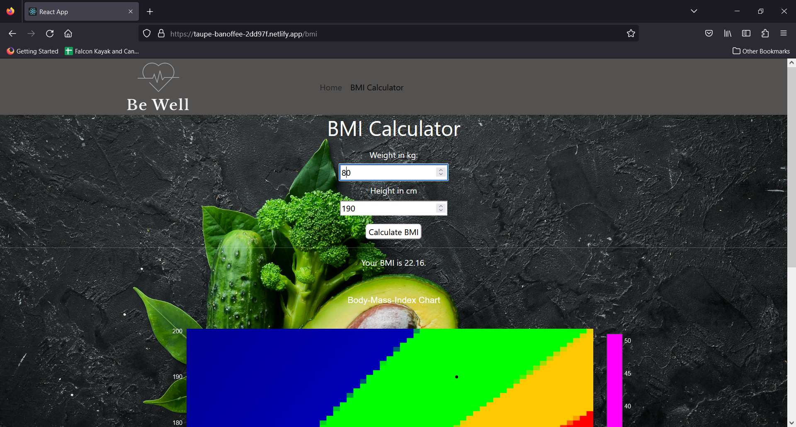

# Be-Well App

## Table of Contents

1. [Description](#description)
2. [Installation](#installation)
3. [Usage](#usage)
4. [License](#license)
5. [Contributing](#contributing)
6. [Future Developmets](#future-developmets)
7. [Tests](#tests)
8. [Questions](#questions)

## Description

Be Well is a health application designed to promote healthy living habits among its users.\
It is a group project that aims to offer a range of features and functionalities to help users achieve their health goals.\
\
Be Well was created with the aim of helping people achieve their health goals and live a healthier lifestyle. We’ve recognized that there are many health applications available on the market, but they often lack a comprehensive approach and tend to focus on specific aspects of health, such as diet or exercise.\
\
To address this issue, the team decided to create an app that would provide users with a more holistic approach to health and wellness. By offering features such as BMI calculators, health tips, yoga tutorials, and healthy food recipes, the app can help users achieve their health goals in a more complete and sustainable way.

## Installation

Clone the repository from github and with `npm install` install all the dependencies from the `package.json` file . 

### Repository

https://github.com/digitinok/be-well-app

### Deployed Webpage

https://taupe-banoffee-2dd97f.netlify.app

Screenshots of Landing page and BMI Calculator of 

## Usage

Run the development server with `npm start`. Open http://localhost:3000 with your browser to see the result.
You can start editing the page by modifying `src/App.js` or create new pages uner `src/pages` or components under `src/components`. The page auto-updates as you edit the file(s).\

## License

The project uses the MIT License. Please check the license file in the repository for further information about what you are allowed to do.

## Contributing

Fork the project and submit further features via pull requests.

## Future Developmets

In the future, the app is planned to be extended with additional features such as health tips, yoga tutorials, and healthy food recipes to help users maintain a healthy lifestyle. These features will be designed to provide users with useful information and tools to improve their overall health and wellbeing.
Furthermore, the users will be presented with a login to be able to safe their health data and see trends in their own health.

## Tests

Currently, the site is manually tested.  The Aim is to set up TDD and BDD with Jest and Enzym for all new features.

## Questions

You can find us on GitHub: https://github.com/digitinok.  
If you have any further questions, please feel free to send us an email.  
